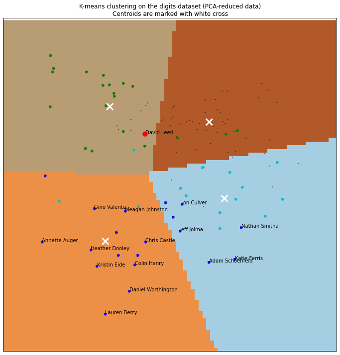

Company culture fit
===================

Where do I fit in compared to your employees linkedin.com profiles?

Getting the data
----------------

### Linkedin.com parser

First we import a parser and some small helper functions for linkedin public profiles:

<pre>from linkedin import linkedin_parser as lp
from linkedin import linkedin_helpers as lh
</pre>

### List of employees

Let's make a list of employees with at least a resonably complete linkedin.com profile page:

<pre>from employee_data import redfin as rf
from employee_data import climate_corp as cc
from employee_data import simply_measured as sm
from employee_data import random_people as rd
</pre>

For example, here are some redfin people and their urls:

<pre>zip(rf.redfin_people, rf.redfin_urls)[0:5]
</pre>

<pre>
    [('Mark Carr', 'http://www.linkedin.com/in/markcarr'),
     ('Jim Lamb', 'http://www.linkedin.com/in/jimplamb'),
     ('Krystin Tate', 'http://www.linkedin.com/in/krystin'),
     ('Andy Taylor', 'http://www.linkedin.com/in/andyataylor'),
     ('Taylor Connolly', 'http://www.linkedin.com/in/taylorconnolly')]
</pre>

### Creating the corpus:

Pick the companies we want to analyize and write the words used in the linkedin.com profile into a text file of features:

<pre>my_url = [&#39;http://www.linkedin.com/in/dleen&#39;]
company_urls = [my_url,
                rf.redfin_urls,
                cc.climate_corp_urls,
                sm.simply_measured_urls,
                rd.random_urls
                ]  

file_name = &#39;people.txt&#39;

try:
    with open(file_name): print(&quot;File exists! Don&#39;t do anything.&quot;)
except IOError:
    print(&quot;Writing the corpus (may take a few minutes)&quot;)
    with open(file_name, &#39;w&#39;) as f:
        for i, u in enumerate(company_urls, start=0):
            lh.write_linkedin_data(f, i, u)
    

from IPython.core.display import clear_output
clear_output()
</pre>

Analyzing the employees
-----------------------

### Tfidf

<pre>from sklearn.feature_extraction.text import TfidfVectorizer

with open(file_name, &#39;r&#39;) as f:
    corpus = []
    labels = []
    for line in f:
        labels.append(int(line[0]))
        corpus.append(line[2:])
        
vectorizer = TfidfVectorizer(min_df=1)
tfidf = vectorizer.fit_transform(corpus)
feature_names = vectorizer.get_feature_names()
labels = np.array(labels) 
</pre>

<pre>import itertools

a = itertools.izip(feature_names, tfidf.data)
b = sorted(a, key=lambda x: x[1], reverse=True) 
print b[:5]
</pre>

    [(u'strings', 0.67608006133504683), (u'beyond', 0.51467175149098765), (u'teggart', 0.49532011897004113), (u'quarterly', 0.47901679669287373), (u'subjects', 0.47320852663699264)]

### PCA

<pre>from sklearn.decomposition import PCA

pca = PCA(n_components=2)
reduced_data = pca.fit_transform(tfidf.toarray())

reduced_data[0:5]
</pre>

<pre>
    array([[-0.07764109,  0.04700812],
           [ 0.08787915, -0.29793791],
           [-0.18104213, -0.43717093],
           [ 0.1544524 , -0.29056254],
           [-0.21848148, -0.26427421]])
</pre>

### k-Means

<pre>from sklearn.cluster import KMeans

kmeans = KMeans(init=&#39;k-means++&#39;, n_clusters=4)
kmeans.fit(reduced_data[1:])
</pre>

<pre>
    KMeans(copy_x=True, init='k-means++', k=None, max_iter=300, n_clusters=4,
        n_init=10, n_jobs=1, precompute_distances=True, random_state=None,
        tol=0.0001, verbose=0)
</pre>

Visualizing the data
--------------------

### Make a grid

<pre># Step size of the mesh. Decrease to increase the quality of the VQ.
h = 0.01     # point in the mesh [x_min, m_max]x[y_min, y_max].

# Plot the decision boundary. For that, we will asign a color to each
x_min, x_max = reduced_data[:, 0].min() - 0.1, reduced_data[:, 0].max() + 0.1
y_min, y_max = reduced_data[:, 1].min() - 0.1, reduced_data[:, 1].max() + 0.1
X, Y = np.meshgrid(np.arange(x_min, x_max, h), np.arange(y_min, y_max, h))

# Obtain labels for each point in mesh. Use last trained model.
me = kmeans.predict(reduced_data[0])
print reduced_data[0]
print me

Z = kmeans.predict(np.c_[X.ravel(), Y.ravel()])

# Put the result into a color plot
Z = Z.reshape(X.shape)
</pre>

    [-0.07764109  0.04700812]
    [3]

### Plot the data

<pre>figure(figsize=(12, 12))
clf()
imshow(Z, interpolation=&#39;nearest&#39;,
          extent=(X.min(), X.max(), Y.min(), Y.max()),
          cmap=cm.Paired,
          aspect=&#39;auto&#39;, origin=&#39;lower&#39;)

plot(reduced_data[:, 0], reduced_data[:, 1], &#39;k.&#39;, markersize=2)
# Plot the centroids as a white X
centroids = kmeans.cluster_centers_
scatter(centroids[:, 0], centroids[:, 1],
           marker=&#39;x&#39;, s=169, linewidths=3,
           color=&#39;w&#39;, zorder=10)

plot(reduced_data[labels == 0, 0],
        reduced_data[labels == 0, 1], &#39;r.&#39;, markersize=20)
text(reduced_data[0, 0], reduced_data[0, 1], &#39;David Leen&#39;)

plot(reduced_data[labels == 1, 0],
        reduced_data[labels == 1, 1], &#39;b.&#39;, markersize=10)
plot(reduced_data[labels == 2, 0],
        reduced_data[labels == 2, 1], &#39;g.&#39;, markersize=10)
plot(reduced_data[labels == 3, 0],
        reduced_data[labels == 3, 1], &#39;c.&#39;, markersize=10)

for i, n in enumerate(sm.simply_measured_people, start=1):
    text(reduced_data[i, 0], reduced_data[i, 1], n)

title(&#39;K-means clustering on the digits dataset (PCA-reduced data)\n&#39;
      &#39;Centroids are marked with white cross&#39;)
xlim(x_min, x_max), ylim(y_min, y_max)
xticks(()), yticks(())
show()
</pre>

<pre>from sklearn.mixture import GMM

def make_ellipses(gmm, ax):
    for n, color in enumerate(&#39;rgb&#39;):
        v, w = np.linalg.eigh(gmm._get_covars()[n][:2, :2])
        u = w[0] / np.linalg.norm(w[0])
        angle = np.arctan2(u[1], u[0])
        angle = 180 * angle / np.pi  # convert to degrees
        v *= 9
        ell = mpl.patches.Ellipse(gmm.means_[n, :2], v[0], v[1],
                                  180 + angle, color=color)
        ell.set_clip_box(ax.bbox)
        ell.set_alpha(0.5)
        ax.add_artist(ell)
</pre>

